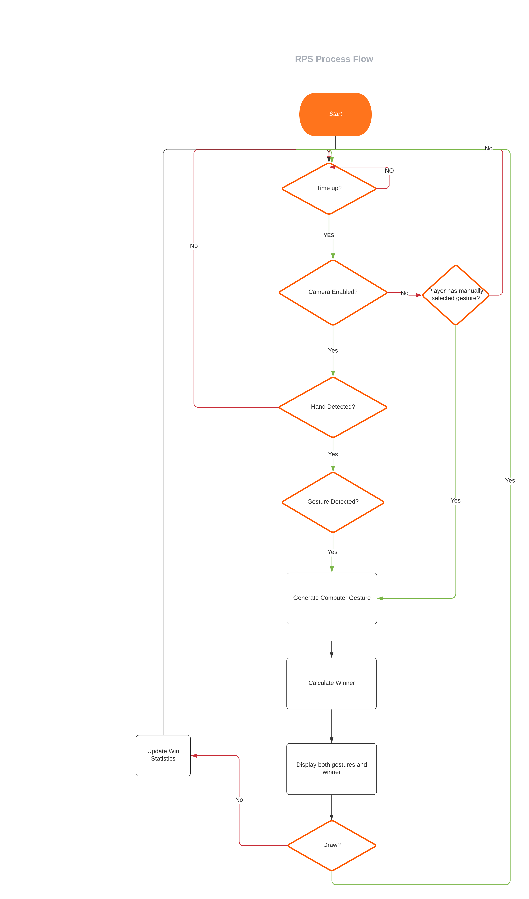
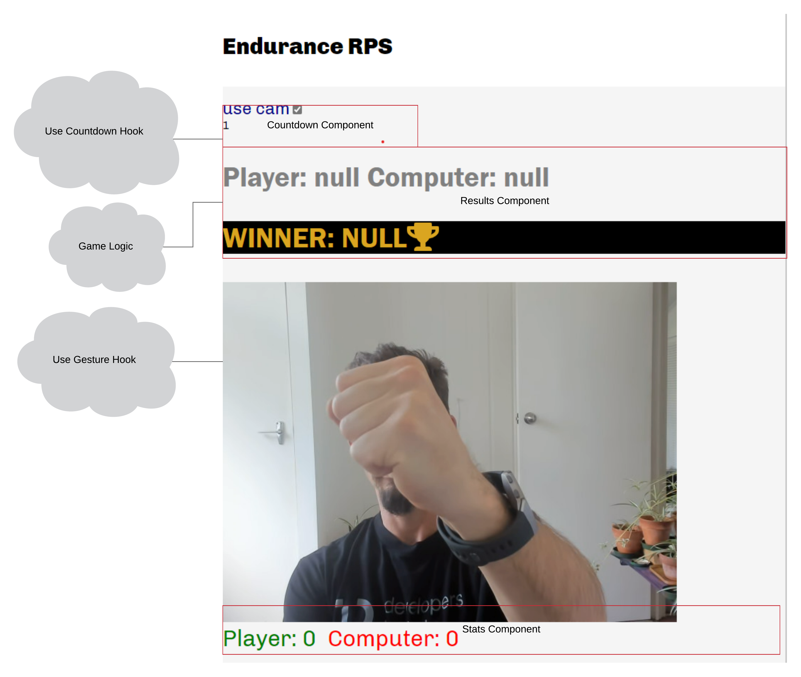

# Project - big-game-finale

---

## Assessment details

- [Level 6 Learning Outcomes](./docs/learning-outcomes-l6.md)

---

## Scenario

Your data science and machine learning skills have enabled the team at `Big Game Inc` to design a game for production that is sure to be a success.
The game will take the Han Dynasty era game of [rock/paper/scissors](https://en.wikipedia.org/wiki/Rock_paper_scissors#History), and pivot it with modern computer vision techniques to enable a human to play against a computer using their hands via the webcam.

The engineering team of high powered React engineers has made a start on the codebase with a skeleton UI, countdown engine, and a webcam component.
They have asked you to help out with the computer vision aspects, game logic, and visual design.

Just as you are about to scour the internet for thousands of images of hands to train your model, you realize that hand gesture recognition is probably a solved problem to some extent and there may be existing models out there you can leverage.

You discover [Handpose](https://www.npmjs.com/package/@tensorflow-models/handpose), a model from Google's Tensorflow that has been converted to Javascript and published to npm for easy ingestion into a web app.

While this will not completely solve your rock/paper/scissors use case, it will provide you with an accurate [3d map of the joints of the hand](https://storage.googleapis.com/tfjs-models/demos/handtrack/index.html), which you can then in turn use to predict the gestures. After some timeboxed research into [the MediaPipe suite](https://google.github.io/mediapipe/), you decide that a simple library called [Fingerpose](https://github.com/andypotato/fingerpose) will serve your needs, by taking the co-ordinates from handpose and classifying them against custom gestures that you can define. In a stroke of good luck, the library even gives an example of how to define the gestures you need.

As you are now the resident expert on the history and psychology of gaming, you have also been asked to pitch an idea for a new feature to make the game even more successful.
You must document your idea from a UX and development viewpoint.

### Note:

Not everyone may be able to manually make the traditional `rock/paper/scissors` hand gestures. If this affects you please reach out to your instructor.
With a minimum of effort, alternate gestures or directional variants of one gesture can be used.
If use of hands in general is an issue, consider using an alternate machine learning based method of 'gesture' selection, such as [full body pose detection](https://blog.tensorflow.org/2018/05/real-time-human-pose-estimation-in.html) or [speech detection](https://codelabs.developers.google.com/codelabs/tensorflowjs-audio-codelab#0)

## Brief

Take the application framework provided to you by the engineering team and take it to completion. You will need to:

- Implement the computer vision strategy outlined above
- Add a fallback strategy in the form of a manual gesture selector to include those who are unable or unwilling to use the webcam
- Implement the game logic flow as defined in the flowchart below.
  - The engineers have provided a test suite to help you implement the various functions independently
- Create wireframes to provide a fun but realistically implementable user experience
- Create a pitch for a new feature, including:
  - a visual mockup
  - technical documentation of the proposed implementation strategy
  - You do not need to implement your pitched feature at this time, as company stakeholders will select any new features from a pool of pitches.

  
Game Logic

  [link for editing](https://lucid.app/lucidchart/de227bc9-410e-4ac5-966d-dbb75c15e2b1/edit?invitationId=inv_665a2ef2-3d38-4842-9575-7631e0ad46fb)

  
Application Architecture

  [link for edidting](https://lucid.app/lucidchart/2222ae44-bb55-48b1-be43-f463a3b4392d/edit?invitationId=inv_014a297a-c3a9-4553-bfcc-d295a50756c2)
  
  

## Getting Started

1. Read through all of the `requirements` in the below instructions before you begin coding
2. Familiarise yourself with the `marking rubric` before you begin coding
3. `clone` this project repository to your local computer using VS Code
4. Open your `terminal` and type: `npm install` to install dependencies. Once installed, you should be able to fire up localhost:3000 by typing `npm start`
5. Work your way through the requirements below. It should be possible to work through them in any order.

## Recommendation

- A good place to start would be to visit the marking rubric to get an understanding of not only what is required, but also the % weighting of each section and the amount of time left until the due date.
- Keep this in mind throughout the project, you can always enhance it and add to it later. Just like any other project.

## Instructions

### Part A - Wireframing

  
Instructions

The application should run in some form out of the box, and you should see something resembling [this image](docs/img/Component-Diagram.png)
You won't be able to actually play the game until you implement the logic.

Here's a rundown of the components:

- [Game.js](./src/component/game/game.js) : The main container for the other components. It contains the logic needed to `control` the other components, which essentially display the data they are given.
  - This component utilisies a third party [countdown hook](https://www.npmjs.com/package/react-countdown-hook) that provides utilities to start, reset, and monitor a timer.
  - a `useEffect` hook in this component contains the skeleton of the game logic as per the [flowchart]('./docs/RPS-logic.png'), and will be triggered when the timer reaches 0.
- [GameResult.js](./src/component/gameResult/GameResult.js) : This component displays both players' chosen gestures, as well as the winner.
- [Countdown.js](./src/component/Countdown.js) : Displays the remaining time left from the timer hook.
- [Stats.js](./src/component/Stats.js) : displays a running total of how many games have been won by the player or computer.
- `Webcam` : a [third party component](https://www.npmjs.com/package/react-webcam) that accesses the camera, and stores a [ref](https://beta.reactjs.org/learn/referencing-values-with-refs) to it in the game component so your logic can access it.
- [ButtonPlayer.js](./src/component/player/human/ButtonPlayer.js) : this provides a `fallback` so that the game can be played in the absence of a webcam. This component will be substituted for the `Webcam` component depending on the `useCamera` state in `Game.js`. This state will be set to false on the absence or denial of camera access, and a handy checkbox has been provided to toggle this as well.
  The idea is that these components can be switched out with a minimum of disruption to the rest of the game logic.

The app is quite style free at this point.
Once you've got your bearings with a high level overview of the project, you should begin by making a mockup of your proposed UI. Select and justify an appropriate tool to visualise your design.
Once you've come up with a design, implement it using the [css modules](https://create-react-app.dev/docs/adding-a-css-modules-stylesheet/) pattern provided, or another pattern of your choosing.

#### Hints

- You have utilised a lot of different wireframing tools to date. Have a think about some of the one's you've preferred. Some `examples` are: Miro, Github issues/project, excalidraw, trello, markdown files, flowcharts/tree diagrams.
- You can dynamically apply styles based on the value of `props` such as the winner, selected gesture, or timer value.

#### Acceptance criteria

- All wireframes are submitted in the `technical-documentation/wireframing` folder
- The wireframes must allow for mobile and larger screensizes.
- The wireframes must handle the case where access permissions to the camera are not granted
- The format and presentation of the wireframes must make them easily understood by a non developer

---

### Part B - Implementation

  
Instructions

#### Step 0: WIREFRAME IMPLEMENTATION

Implement your design as per your wireframes.

#### Step 1: BUTTON PLAYER SELECTION

Some users are unwilling or unable to use the cam, so to be inclusive we will implement a non-camera version of the game. As per your mockup, implement `ButtonPlayer.js`

#### Hints

- There are prewritten tests to help you complete all steps in Part B of this project. In addition, make sure to read the acceptance criterias in each step.

#### Acceptance criteria

- there are 3 buttons, one for each of the following: `rock,` `paper,` `scissors.`
- the NAME of each button must reflect each gesture. (reference the `gestureConstants.js` file to avoid typos and keep consistent with naming conventions)
- when each button is clicked, it should call the handler passed in from the parent component, with the name of the selected gesture as an argument.
- there should be some visual indication of what option you have selected.
- unit tests pass for the ButtonPlayer component

#### Step 2: GAME LOGIC

Implement the logic for the winner of the game.
Firstly implement `generateComputerGesture` It should randomly return a valid gesture.

Secondly implement the `ascertainVictor` logic. It should return a valid option from `winnerOptions` based on the passed in `player` and `computer` gesture.

#### Hints

- Use the `game` folder to help you get your bearings for this part.
- Use the `gamelogic unit tests` to help guide you.
- Using AI to defeat the human player is out of scope at this time.
- Remember folks: rock blunts scissors, scissors cuts paper, paper wraps rock. Reach out if you are confused about the game logic.

#### Acceptance criteria

- It should randomly return a valid gesture for generateComputerGesture.
- ascertainVictor should accurately return the result for each round. ie a player victory, computer victory or draw.
- unit tests pass for gamelogic.

#### Step 3: GESTURE CLASSIFICATION

Define the `rock/paper/scissors` gestures in `gestures.js`. Then import your gestures into `gestureClassifier.js` and use the fingerpose model to classify one of your gestures from a list of handpose Landmarks.

#### Hints

- Use the gesture folder for this section, the scissors gesture has already been defined for you.
- You may make some alternative gestures if you wish, but keep it clean people!
- The gesture classifier tests will help you do this with some fake handpose landmarks.

#### Acceptance criteria

- Both the ROCK and PAPER gesture functions are implemented as per the SCISSORS example.
- Given a set of handpose landmarks matching either ROCK, PAPER or SCISSORS, the function will return the correct response.
- This will result in unit tests passing for gesture classifier.

#### Step 4 USE GESTURE HOOK

Your tech lead has made the decision to extract this logic to a custom hook, to encapsulate the complex logic behind a simple interface for cleanliness and potential reuse. This hook will return one function that takes in the video canvas and returns the name of any detected gesture. You will need to implement the useGesture hook, see below for getting started.

- import the @tensorflow-models/handpose model, and the classifyGestures function you prepared earlier.
- implement the getHandposeLandmarks function to call estimateHands on this canvas and return the most likely prediction.
- call this function in the detectGesture function. If there are no results, return null, otherwise pass your landmarks to your classifyGestures Function.
- If your classify gestures detected any gestures, return the name of the first and most likely gesture.
- if no gestures were detected, again return null so this can be handled in the calling component.

#### Hints

- you should get started in the `hooks` folder for this section.
- A custom hook is essentially a react component that does not render anything to the DOM. It can still use all the other power of react such as state and other hooks.
- This hook should return a function that accepts a canvas from your webcam, and returns the name of a gesture if it detects one.

#### Acceptance criteria

- unit tests for useGesture component pass

---

### Part C - Feature Pitch

  
Instructions

`Big Game Inc.` welcomes ideas for new features, improvements, or bug fixes from within the company.
After spending much time playing the game and navigating the codebase, you have a killer idea. It's time to create some documentation to communicate your idea to the greater team.

The exact format you use here is up to you, but you need to communicate the added value to non technical stake holders as well as outline the technical aspect of the feature to prove it is feasible.

#### Note

you `do not` need to actually write the code, but you must select and justify any architectural or design pattern decisions that you think would be useful for your future development peers to implement this feature.

- Here are some ideas to get you thinking:
  - when the player/computer reaches a certain score, an alert is displayed or an animation.
  - create a total number of games played score.
  - limit total number of games/victories possible.
  - add a 4th or nth gesture.
  - reset score button/functionality
  - use some [historic or alternate gestures](https://en.wikipedia.org/wiki/Rock_paper_scissors#History)

#### Hints

- you may copy and extend your original wireframes from part A
- you may add any supporting documentation as necessary
- you may copy and extend / modify the provided diagrams
- you may add subfolders and as many files as you wish to the `technical-documentation/pitch` folder
- document any changes or refactoring of the existing codebase you would recommend

#### Acceptance criteria

- wireframes showcasing proposed feature are committed to the `technical-documentation/pitch` folder
- wireframes clearly communicate your new feature pitch to non-technical stakeholders
- technical documentation is uploaded to the `technical-documentation/pitch` folder
- technical documentation clearly communicates your proposed implementation strategy to your development peers
- the proposed technical implementation strategy is feasible

---

### Part D - Security Audit

  
Instructions

In `technical-documentation/security-audit/readme.md`, add a paragraph or two answering the following questions:

- What is the greatest security risk in this application?
- How is this risk mitigated? or if it is not, how should it be?
  Ensure you have considered any new risks that may be introduced by your new feature.
  If you do not feel there are any security risks, you should explain why.

There is no one correct answer or deliberate vulnerability here, but you must prove you can think critically about the subject, including when proposing new features.

#### Acceptance criteria

- `technical-documentation/security-audit/readme.md` answers both the questions above.

# Submit your Project

- [ ] Commits are pushed to GitHub
- [ ] Project has been submitted in Google Classroom
