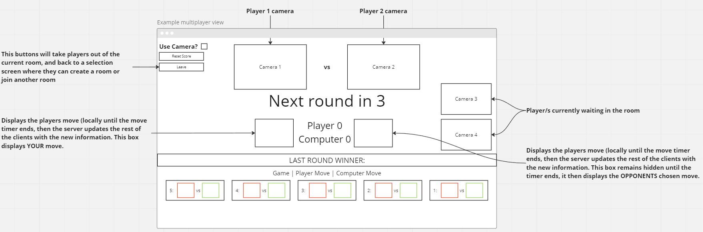

# Feature Pitch

## The idea
(Online) Multiplayer. I suggest the addition of being able to verse other people! Sure, playing against a computer is great. But it can sure get dull. Being able to connect to a room online, and play against other people would be much more entertaining.

## Execution
For this, we would need to create a backend system that would handle all the connections. We wouldn't need to verify the move server side, as this can be done client side (even if the user manually sends the request, it won't be at risk due to the correct validation processes being in place to only accept 1 of the 3 possible moves).

Clients would join a room or create one. Creating a room would provide a unique code that they can share with others to allow them to join.

Once players are ready to start, the timer would countdown and the game would begin.

The number of players in a single room could be limitless, but I'd recommend setting a cap so rooms don't get too large. Allowing players to cap their rooms so no more than X people can join should also be an option, so if a player only wants to play against 1 other person, then they would set the player count to 2 (1 spot for themselves, and 1 spot for another player).

Multiple game modes could be introduced as well such as king of the hill, where 1 player remains the king as long as they win the match. If not, they go to the back of the line and the winner becomes the new king of the hill. The game continues with each player battling it out against the king, until the game timer runs out. Whoever is king (or remained king the longest), is declared the overall winner.

Players would also be able to play a standard best of 3 match, or best of 1 match instead.

## Considerations
Keeping in mind, players would not be able to use their cameras to gesture a move to the camera as players would be able to see each other. However, this could be fixed by hiding the camera while turn players are choosing. Then having a fixed time between rounds where cameras aren't hidden and the results can be displayed for the room to see.

## Technicalities
I suggest this could be done simple using real-time bidirectional event-based communication (using socket.io). 

This allows for different rooms to be created, and players to simply come and go as they please. Games can be handled by the server in real time (the server would determine the winner and announce it to the respective room).

this package should do the job: https://www.npmjs.com/package/socket.io

## Monetization
Being an online service, you could potentially charge users to create rooms larger than X people (say, 3 MAX on free tier, up to 10 on a paid tier). This could generate income to cover costs of hosting the application. Because this application is also fairly simple, and the wireframes have alot of whitespace in them, ads could also be placed in thsi areas to generate additional income (however ads can be controversial, so maybe only displaying ads to free tier users)

## Example wireframe
### This view is of a game in progress, inside an existing room with 4 players
